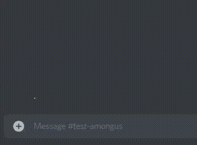
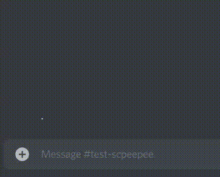
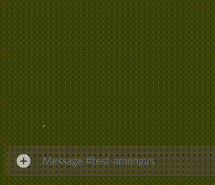
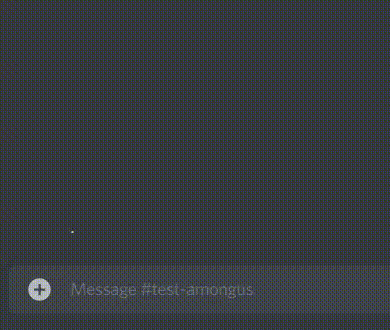

# Game session bot
This is a discord bot for hosting game sessions, like Among Us
# How to use it
## Actually installing it
You need the following:
- Python 3 or later
- [discord.py](https://github.com/Rapptz/discord.py) module
- An environment variable called `BOTTOKEN` containing the token
## Configuring it
In `games.py` you can find the example games, made of python dictionaries, with the game's name, the server's channel where the game talk will happen, and the role which the bot will ping\
There is also a list with all of the dictionaries names, both need to be updated
## Using the bot
There are 3 simple commands
- ?hostgame
- ?cancelhost
- ?endhost
### ?hostgame
Starts a new session based on the current channel\
\
If a session is already in progress\

### ?endhost
For when you finished playing\

### ?cancelhost
For when there aren't enough people to play\

##### ?help
This is also a thing in case someone forgot the commands ~~come on it's only 3 you can do it~~
# TODO
Fix any time related commands like `?time` which should display the remiaining time until the current session, it now displays god knows what\
Ping the users who reacted with a thumbs up but didn't join the game VC 